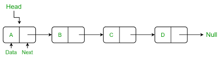

# **0x13. C - More singly linked lists**

 
picture from : https://media.geeksforgeeks.org/wp-content/cdn-uploads/gq/2013/03/Linkedlist.png

# This is a continuation of **[linked list projcet](../0x12-singly_linked_lists)**
 

# Resources 
Google 
Youtube 

# **Tasks** 
[0. Print list](./0-print_listint.c)
Write a function that prints all the elements of a listint_t list. 
> * Prototype: size_t print_listint(const listint_t *h);
> * Return: the number of nodes
> * Format: see example
> * You are allowed to use printf

Example

	vagrant@ubuntu-focal:~/alx-low_level_programming/0x13-more_singly_linked_lists$ cat test_files/0-main.c
	#include <stdlib.h>
	#include <string.h>
	#include <stdio.h>
	#include "../lists.h"
	
	/**
 	* main - check the code
 	*
 	* Return: Always 0.
 	*/
	int main(void)
	{
    	listint_t *head;
    	listint_t *new;
    	listint_t hello = {8, NULL};
    	size_t n;
	
    	head = &hello;
    	new = malloc(sizeof(listint_t));
    	if (new == NULL)
    	{
        	printf("Error\n");
        	return (1);
    	}
    	new->n = 9;
    	new->next = head;
    	head = new;
    	n = print_listint(head);
    	printf("-> %lu elements\n", n);
    	free(new);
    	return (0);
	}
	vagrant@ubuntu-focal:~/alx-low_level_programming/0x13-more_singly_linked_lists$ gcc -Wall -pedantic -Werror -Wextra -std=gnu89 test_files/0-main.c 0-print_listint.c -o a
	vagrant@ubuntu-focal:~/alx-low_level_programming/0x13-more_singly_linked_lists$ ./a
	9
	8
	-> 2 elements
	vagrant@ubuntu-focal:~/alx-low_level_programming/0x13-more_singly_linked_lists$

[1. List length](./1-listint_len.c) 
Write a function that returns the number of elements in a linked listint_t list. 
> * Prototype: size_t listint_len(const listint_t *h);

**Example**
	vagrant@ubuntu-focal:~/alx-low_level_programming/0x13-more_singly_linked_lists$ cat test_files/1-main.c
	#include <stdlib.h>
	#include <string.h>
	#include <stdio.h>
	#include "../lists.h"
	
	/**
 	* main - check the code
	 *
 	* Return: Always 0.
 	*/
	int main(void)
	{
    	listint_t *head;
    	listint_t *new;
    	listint_t hello = {8, NULL};
    	size_t n;
	
    	head = &hello;
    	new = malloc(sizeof(listint_t));
    	if (new == NULL)
    	{
        	printf("Error\n");
        	return (1);
    	}
    	new->n = 9;
    	new->next = head;
    	head = new;
    	n = listint_len(head);
    	printf("-> %lu elements\n", n);
    	free(new);
    	return (0);
	}
	vagrant@ubuntu-focal:~/alx-low_level_programming/0x13-more_singly_linked_lists$ gcc -Wall -pedantic -Werror -Wextra -std=gnu89 test_files/1-main.c 1-listint_len.c -o b
	vagrant@ubuntu-focal:~/alx-low_level_programming/0x13-more_singly_linked_lists$ ./b
	-> 2 elements
	vagrant@ubuntu-focal:~/alx-low_level_programming/0x13-more_singly_linked_lists$

[2. Add node](./2-add_nodeint.c) 
Write a function that adds a new node at the beginning of a listint_t list. 
> * Prototype: listint_t *add_nodeint(listint_t **head, const int n);
> * Return: the address of the new element, or NULL if it failed

**Example**

	vagrant@ubuntu-focal:~/alx-low_level_programming/0x13-more_singly_linked_lists$ cat test_files/2-main.c
	#include <stdlib.h>
	#include <string.h>
	#include <stdio.h>
	#include "../lists.h"
	
	/**
	 * main - check the code
 	*
 	* Return: Always 0.
 	*/
	int main(void)
	{
    	listint_t *head;
	
    	head = NULL;
    	add_nodeint(&head, 0);
    	add_nodeint(&head, 1);
    	add_nodeint(&head, 2);
    	add_nodeint(&head, 3);
    	add_nodeint(&head, 4);
   	add_nodeint(&head, 98);
    	add_nodeint(&head, 402);
    	add_nodeint(&head, 1024);
    	print_listint(head);
    	return (0);
	}
	vagrant@ubuntu-focal:~/alx-low_level_programming/0x13-more_singly_linked_lists$ gcc -Wall -pedantic -Werror -Wextra -std=gnu89 test_files/2-main.c 2-add_nodeint.c 0-print_listint.c -o c
	vagrant@ubuntu-focal:~/alx-low_level_programming/0x13-more_singly_linked_lists$ ./c
	1024
	402
	98
	4
	3
	2
	1
	0
	vagrant@ubuntu-focal:~/alx-low_level_programming/0x13-more_singly_linked_lists$

[3. Add node at the end](./3-add_nodeint_end.c) 
Write a function that adds a new node at the end of a listint_t list. 
> * Prototype: listint_t *add_nodeint_end(listint_t **head, const int n);
> * Return: the address of the new element, or NULL if it failed

	vagrant@ubuntu-focal:~/alx-low_level_programming/0x13-more_singly_linked_lists$ cat test_files/3-main.c
	#include <stdlib.h>
	#include <string.h>
	#include <stdio.h>
	#include "../lists.h"
	
	/**
 	* main - check the code
	*
 	* Return: Always 0.
 	*/
	int main(void)
	{
    	listint_t *head;
	
    	head = NULL;
    	add_nodeint_end(&head, 0);
    	add_nodeint_end(&head, 1);
    	add_nodeint_end(&head, 2);
    	add_nodeint_end(&head, 3);
    	add_nodeint_end(&head, 4);
    	add_nodeint_end(&head, 98);
    	add_nodeint_end(&head, 402);
    	add_nodeint_end(&head, 1024);
    	print_listint(head);
    	return (0);
	}
	vagrant@ubuntu-focal:~/alx-low_level_programming/0x13-more_singly_linked_lists$ gcc -Wall -pedantic -Werror -Wextra -std=gnu89 test_files/3-main.c 3-add_nodeint_end.c 0-print_listint.c -o d
	vagrant@ubuntu-focal:~/alx-low_level_programming/0x13-more_singly_linked_lists$ ./d
	0
	1
	2
	3
	4
	98
	402
	1024
	vagrant@ubuntu-focal:~/alx-low_level_programming/0x13-more_singly_linked_lists$

